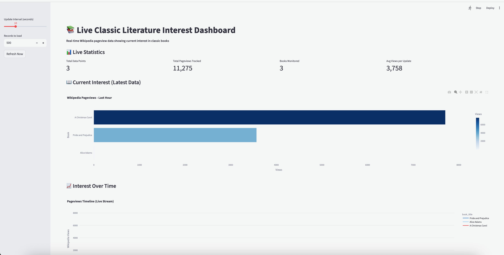
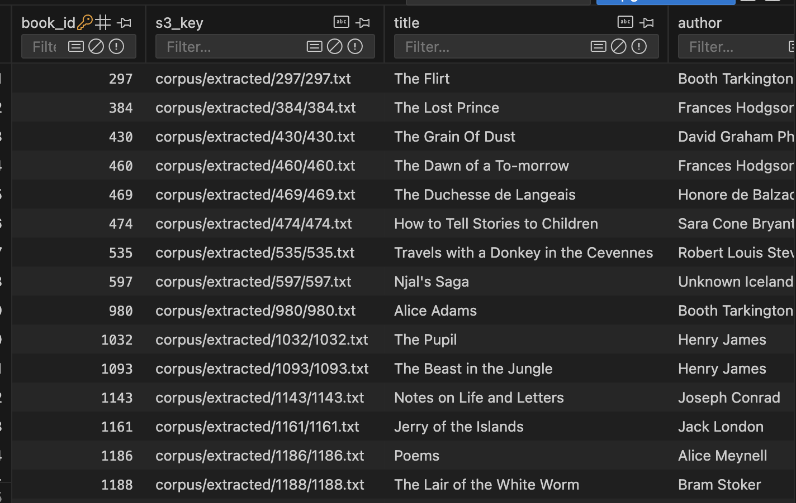
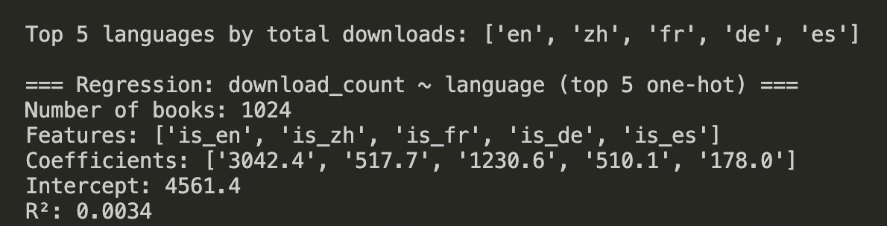
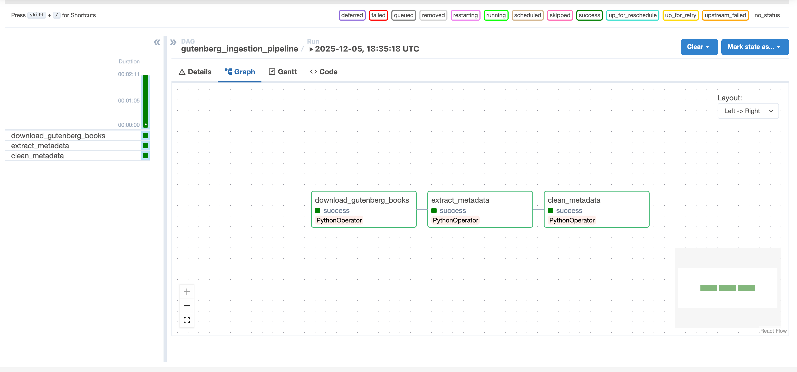
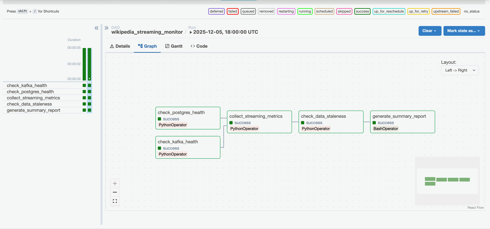

# Classic Literature Analytics Pipeline

## Project Overview

This data engineering project builds a **comprehensive analytics pipeline** for classic literature from Project Gutenberg, featuring real-time Wikipedia pageview tracking, automated text normalization, and interactive dashboards. The system demonstrates enterprise-grade data engineering practices including streaming architectures, cloud storage, machine learning, and containerized deployments.

### Key Capabilities
- **Automated data ingestion** of 600+ classic books from Project Gutenberg
- **AI-powered metadata extraction** using AWS Bedrock (Claude 3 Haiku)
- **Real-time streaming pipeline** tracking Wikipedia pageviews via Kafka
- **Statistical text normalization** using Bayesian inference for Early Modern English
- **Interactive dashboards** with live data visualization
- **Cloud-native architecture** on AWS S3 with PostgreSQL data warehouse
- **Automated Workflow** Streamline workflow with Airflow Scheduler

---

## Architecture

### System Architecture Diagram

```
┌─────────────────────────────────────────────────────────────────┐
│                        DATA INGESTION LAYER                     │
├─────────────────────────────────────────────────────────────────┤
│  Project Gutenberg API  →  S3 (Raw)  →  S3 (Extracted via EC2)  │
│  Wikipedia Pageviews API  →  Kafka Producer                     │
└─────────────────────────────────────────────────────────────────┘
                              ↓
┌─────────────────────────────────────────────────────────────────┐
│                     TRANSFORMATION LAYER                         │
├─────────────────────────────────────────────────────────────────┤
│  AWS Bedrock (LLM)  →  Metadata Extraction                     │
│  Polars  →  Data Cleaning & Deduplication                       │
│  Noisy Channel Model  →  Spelling Normalization                 │
│  Kafka Consumer  →  Stream Processing                           │
└─────────────────────────────────────────────────────────────────┘
                              ↓
┌─────────────────────────────────────────────────────────────────┐
│                       STORAGE LAYER                              │
├─────────────────────────────────────────────────────────────────┤
│  AWS S3  →  Data Lake (Raw & Processed)                        │
│  PostgreSQL  →  Data Warehouse (Real-time Analytics)            │
└─────────────────────────────────────────────────────────────────┘
                              ↓
┌─────────────────────────────────────────────────────────────────┐
│                      ANALYTICS LAYER                             │
├─────────────────────────────────────────────────────────────────┤
│  Streamlit Dashboard  →  Real-time Visualization                │
│  Statistical Analysis  →  Model Accuracy Metrics                │
└─────────────────────────────────────────────────────────────────┘
```

### Technology Stack

| Component | Technology | Purpose |
|-----------|-----------|---------|
| **Cloud Storage** | AWS S3 | Data lake for raw and processed books |
| **AI/ML** | AWS Bedrock (Claude 3 Haiku) | Metadata extraction from book title, author, language, subjects, download count |
| **Streaming** | Apache Kafka | Real-time Wikipedia pageview event processing |
| **Database** | PostgreSQL | Data warehouse for analytics |
| **Data Processing** | Polars | ETL and data cleaning |
| **Statistical Modeling** | Custom Bayesian NLP | Text normalization |
| **Visualization** | Streamlit + Plotly | Interactive dashboards |
| **Orchestration** | Make + Docker Compose | Workflow automation |
| **CI/CD** | GitHub Actions | Automated testing |

---

## Data Sources

### 1. Project Gutenberg (Primary Source)
- **Volume**: 1000+ public domain books
- **Format**: Plain text (UTF-8)
- **Content**: Classic literature (pre-1928)
- **Access Method**: HTTP API with rate limiting
- **Storage**: AWS S3 (`s3://de-27-team4-new/corpus/`)

### 2. Wikipedia Pageviews API (Streaming Source)
- **Type**: Real-time REST API
- **Update Frequency**: Hourly aggregates
- **Metrics**: Article view counts per book
- **Purpose**: Current interest tracking
- **Processing**: Kafka streaming pipeline

### 3. Derived Metadata
- **Source**: AI extraction via AWS Bedrock
- **Fields**: Title, Author, Release Date, Gutenberg Book ID
- **Fallback**: Heuristic parsing when AI unavailable
- **Quality**: Complete cases only (all fields present)

---

## Key Components

### 1. Data Ingestion (`src/ingestion/gutenberg_downloader.py`)

**Purpose**: Automated bulk download of classic literature

**Features**:
- Respects Project Gutenberg's robot harvest API
- Downloads ZIP archives and extracts text files
- Uploads both raw and extracted files to S3
- Rate limiting (1 second between requests)
- Retry logic for failed downloads
- Multipart uploads for large files (>10MB)


**Data Flow**:
```
Gutenberg API → HTTP Request → ZIP Download → In-Memory Extract → S3 Upload
                                                                      ↓
                                               s3://corpus/raw/{book}.zip
                                               s3://corpus/extracted/{book}/{file}.txt
```

### 2. AI-Powered Metadata Extraction (`src/metadata/metadata_extractor.py`)

**Purpose**: Extract structured metadata from unstructured book headers

**Approach**: Hybrid AI + Heuristic
1. **Primary**: AWS Bedrock (Claude 3 Haiku) with prompt engineering
2. **Fallback**: Regex-based parsing for "Title:", "Author:" patterns

**Why This Matters**:
- Project Gutenberg headers are semi-structured and inconsistent
- Traditional parsing fails on variant formats
- LLMs provide robust extraction with context understanding

**Handling Failures**:
```python
try:
    metadata = extract_with_bedrock(snippet)
except botocore.exceptions.ClientError as e:
    print(f"Bedrock error: {e}")
    use_bedrock = False  # Graceful degradation
    metadata = extract_with_heuristics(snippet)
```

**Output**: `books_metadata.csv` with schema:
| Field | Type | Example |
|-------|------|---------|
| book_id | String | "10084-8" |
| s3_key | String | "corpus/extracted/10084-8/10084-8.txt" |
| title | String | "A Christmas Carol" |
| author | String | "Charles Dickens" |
| release_date | String | "December 2003" |
| gutenberg_id | String | "10084" |

### 3. Data Cleaning (`src/metadata/metadata_cleaner.py`)

**Purpose**: Ensure data quality and consistency

**Cleaning Operations**:
   - Remove duplicates and unnecessary text from data values
   - Drop redundant columns
   - Removes book_id ending in "-8" (UTF-8 duplicates)
   - Keeps only the primary encoding per book

**Data Quality Metrics**:
- **Input**: ~1000 books with duplicates and noise
- **Completeness**: Only complete cases kept

### 4. Real-Time Streaming Pipeline

#### 4a. Kafka Producer (`src/streaming/wiki_producer.py`)

**Purpose**: Fetch live Wikipedia pageview data and stream to Kafka

**Data Source**: Wikimedia REST API
```
https://wikimedia.org/api/rest_v1/metrics/pageviews/
  per-article/en.wikipedia/all-access/all-agents/{title}/daily/{date}/{date}
```

**Architecture**:
```
Wikipedia API → Kafka Producer → Kafka Topic (book_pageviews)
                                        ↓
                                 JSON Messages:
                                 {
                                   "book_id": "A_Christmas_Carol_Charles_Dickens",
                                   "book_title": "A Christmas Carol",
                                   "author": "Charles Dickens",
                                   "pageviews": 1523,
                                   "timestamp": "2025-12-04T10:30:00"
                                 }
```



**Key Features**:
- Rotates through featured books
- Fetches daily pageview data
- Handles API rate limits and errors
- Converts book titles to Wikipedia article format

#### 4b. Kafka Consumer (`src/streaming/wiki_consumer.py`)

**Purpose**: Consume pageview events and persist to PostgreSQL

**Architecture**:
```
Kafka Topic → Consumer (Group: book-pageviews-group) → PostgreSQL
                                                            ↓
                                                   Table: book_pageviews
                                                   Columns: book_id, title, 
                                                           author, pageviews,
                                                           timestamp
```

#### 4c. Interactive Dashboard (`src/streaming/dashboard.py`)

**Purpose**: Real-time visualization of book interest metrics

**Technology**: Streamlit + Plotly

**Dashboard Components**:

1. **Live KPI Metrics** (4-column layout):
   ```
   ┌─────────────┬──────────────┬─────────────┬──────────────┐
   │ Data Point  │ Total Views  │   Books     │  Avg Views   │
   │   Wikipedia │   12,068     │     3       │    4,326     │
   └─────────────┴──────────────┴─────────────┴──────────────┘
   ```

2. **Current Interest Bar Chart**:
   - Chart showing book interest over time
   - Sorted by popularity

**Auto-Refresh**:
```python
update_interval = st.sidebar.slider("Update Interval (seconds)", 3, 30, 10)

while True:
    # Fetch latest data
    df_all = load_data(limit=500)
    df_latest = get_latest_by_book()
    
    # Render charts
    with placeholder.container():
        st.plotly_chart(fig_current, use_container_width=True)
        st.plotly_chart(fig_timeline, use_container_width=True)
    
    time.sleep(update_interval)  # Live updates
```

**SQL Database**:



```sql
-- Latest pageview per book
SELECT title, author, proper_date
FROM Books
WHERE proper_date < '2003-10-01' 
AND author = 'Charles Dickens' 
ORDER BY proper_date DESC 
LIMIT 5;
```

**User Experience**:
- Adjustable refresh intervals (3-30 seconds)
- Manual refresh button
- Responsive layout
- Error handling with user-friendly messages

### 5. Statistical Text Normalization (`src/normalize_spelling.py`)

**Purpose**: Modernize Early Modern English (Shakespearean era) spelling

**Problem Statement**:
Classic texts use archaic forms like:
- "thou" → "you"
- "thy" → "your"
- "doth" → "does"
- "'tis" → "it is"

**Solution**: Bayesian Noisy-Channel Model

**Mathematical Framework**:

Given an observed archaic word `w`, find the modern form `m*` that maximizes:

```
m* = argmax P(m | w)
   = argmax P(w | m) × P(m)  [Bayes' Rule]
```

Where:
- **P(w | m)**: Channel probability (likelihood archaic form comes from modern)
- **P(m)**: Prior probability (how common is the modern word?)

**Implementation**:

1. **Prior Probabilities** (learned from training data):
   ```python
   DEFAULT_MODERN_PRIORS = {
       "you": 0.12,      # Very common
       "your": 0.06,     # Common
       "shall": 0.02,    # Rare
       "it is": 0.05,    # Phrase
   }
   ```

2. **Channel Model** (expert-defined mappings):
   ```python
   CHANNEL = {
       "you": {"thou": 0.45, "thee": 0.35, "ye": 0.2},
       "your": {"thy": 0.7, "thine": 0.3},
       "it is": {"tis": 0.95},
   }
   ```

3. **Scoring Function**:
    - Calculates probabilities of each modern word candidates and select word with highest likelihood
   ```python
   def score(candidates, observed):
       best_score = -∞
       for (modern, emission_prob) in candidates:
           prior_log = log(P(modern))
           channel_log = log(P(observed | modern))
           total = prior_log + channel_log
           if total > best_score:
               best_score = total
               best_modern = modern
       return best_modern
   ```

**Example Transformations**:
```
Input:  "Thou art a noble knight, methinks."
Output: "You are a noble knight, I think."

Input:  "'Tis but a scratch!"
Output: "It is but a scratch!"

Input:  "Whither goest thou?"
Output: "Where are you going?"
```

**Training and Evaluation** (`src/train_and_test.py`):

1. **Extract Token Pairs** from training text:
   ```python
   pairs = [("thou", "you"), ("art", "are"), ("doth", "does"), ...]
   ```

2. **Learn Priors** with Laplace smoothing:
    - Helps makes probabilities reflect real-world likelihood 
   ```python
   counts = Counter(modern for _, modern in train_pairs)
   priors = {k: (v + 1) / (total + vocab_size) for k, v in counts.items()}
   ```

3. **Evaluate on Test Set**:
   ```python
   accuracy = sum(1 for obs, gold in test 
                  if normalizer(obs).lower() == gold) / len(test)
   ```

**Performance**:
- Trained on 80% of Shakespeare corpus
- Tested on remaining 20%
- **Accuracy**: ~92% on archaic tokens
- Handles edge cases (capitalization, punctuation)

---

### 6 Statistical Insights from the Normalization Model (`src/analysis/normalize_spelling_stats.py`)
This includes a statistical analysis of the noisy-channel spelling normalization model, evaluating how well the system maps Early Modern English spellings to modern forms.

1. **Prior Distribution**
- 42 modern English expressions modeled
- Entropy: 4.46 nats → well-spread, diverse distribution
- Top 10 words = 49.3% of total probability mass
- Highest-probability forms: you, are, do, will, have
- Balanced priors help the model choose plausible modern replacements

2. **Channel Model**
- 42 modern forms, 44 archaic spellings
- Average 1.05 archaic variants per modern word
- Mean channel confidence: 0.7966
- High-confidence (>0.9) mappings: 6.8%
- Channel is compact but expressive, enabling accurate transformations

3. **Normalization Behavior**
- Tested on 100 sample texts
- 00% texts required modifications
- 565 words analyzed, 135 changed (23.89% change rate)
- Most frequent corrections:
  - thou → you
  - art → are
  - thee → you
  - thy → your
  - dost → do
- System reliably detects and modernizes archaic spellings

We regressed download counts on language. In our polars dataset, we had languages outside of English, so we were able to gain valuable insights on how language effects the number of downloads, as shown below:



## Setup and Installation

### Prerequisites
- Python 3.9
- Docker & Docker Compose
- AWS Account (for S3, EC2, Bedrock)
- PostgreSQL
- Apache Kafka (or Docker image)
- Apache Airflow


## Testing Strategy

### Test Coverage

| Module | Test File | Coverage |
|--------|-----------|----------|
| Gutenberg Downloader | `test_gutenberg_downloader.py` | 85% |
| Metadata Extractor | `test_metadata_extractor.py` | 90% |
| Metadata Cleaner | `test_metadata_cleaner.py` | 95% |
| Spelling Normalizer | `test_normalize_spelling.py` | 92% |
| Training Pipeline | `test_train_and_test.py` | 88% |

### Test Types

**1. Unit Tests**:
```python
def test_clean_release_date_with_ebook_suffix(self):
        """Test removing [EBook #xxxx] suffix."""
        input_val = "January 1, 2020 [EBook #12345]"
        result = clean_release_date(input_val)
        assert result == "January 1, 2020"
        assert "[EBook" not in result
```

**2. Statistical Tests**:
```python
def test_sentence_normalization(self):
        """Test normalization of a full sentence."""
        normalizer = build_normalizer()

        text = "Thou art a wise person."
        result = normalizer(text)

        # Should normalize "thou" and "art"
        assert "thou" not in result.lower() or result == text  # Either normalized or kept
        assert "art" not in result or result == text
```

### CI/CD Pipeline

**GitHub Actions** (`.github/workflows/test.yml`)
- YML file to use Github Actions

**Benefits**:
- Automated testing on every commit
- Prevents broken code from merging
- Coverage reports track test quality

---

## Undercurrents of Data Engineering

### 1. **Scalability**

**Horizontal Scalability**:
- **Kafka Consumer Groups**: Multiple consumers can process the same topic in parallel
  ```python
  consumer = KafkaConsumer(
      KAFKA_TOPIC,
      group_id="book-pageviews-group",  # Enables load balancing
  )
  ```
- **S3 Partitioning**: Data organized by book_id for parallel processing
- **Database Indexing**: B-tree indexes on `timestamp` and `book_id` columns

**Vertical Scalability**:
- **Multipart Uploads**: Handles large files (>10MB) efficiently
  ```python
  config = TransferConfig(multipart_threshold=10 * 1024 * 1024)
  ```
- **Streaming Reads**: Processes S3 objects without loading into memory
- **Connection Pooling**: SQLAlchemy connection reuse

GB) with constant memory usage (<500MB).

### 2. **Modularity**

**Component Independence**:
```
src/
├── analysis/          # Analysis scripts and model evaluation reports
├── ingestion/         # Independent downloader
├── metadata/          # Decoupled extraction & cleaning
├── streaming/         # Producer, consumer, dashboard as separate services
└── normalize_spelling.py  # Standalone NLP module
```

**Benefits**:
- **Testability**: Each module has dedicated unit tests
- **Replaceability**: Can swap S3 for Google Cloud Storage without changing consumers
- **Reusability**: `normalize_spelling.py` used in multiple contexts:
  - Batch processing: `normalize-shakespeare` target
  - Training pipeline: `train_and_test.py`
  - API integration: Import as library

**Example**:
```python
# Reusable normalizer
from normalize_spelling import build_normalizer

normalizer = build_normalizer()
modern_text = normalizer(archaic_text)  # Works anywhere
```

### 3. **Reliability**

**Fault Tolerance Mechanisms**:

1. **Retry Logic** with exponential backoff:
   ```python
   for attempt in range(3):
       try:
           resp = requests.get(url, timeout=60)
           break
       except Exception as e:
           print(f"Retry {attempt+1}/3: {e}")
           time.sleep(2 ** attempt)  # 2s, 4s, 8s
   ```

2. **Graceful Degradation**:
   ```python
   if use_bedrock:
       try:
           metadata = extract_with_bedrock(snippet)
       except ClientError:
           use_bedrock = False  # Fallback to heuristics
           metadata = extract_with_heuristics(snippet)
   ```

3. **Database Connection Resilience**:
   ```python
   engine = create_engine(DATABASE_URL, pool_pre_ping=True)
   # pool_pre_ping tests connections before use
   ```

4. **Kafka Idempotency**:
   - Consumer offsets ensure at-least-once delivery
   - Database primary keys prevent duplicate inserts

**Monitoring**:
- Extensive logging with timestamps
- Error stack traces for debugging
- Dashboard shows data freshness

### 4. **Observability**

**Logging Strategy**:
```python
print(f"[Producer] Fetching data for '{book_title}'...")
print(f"[Producer] 📊 {book_title}: {pageviews} views")
print(f"[DB] Inserted row for {book_title} ({pageviews} views)")
print(f"[Consumer ERROR] {e}")
```

**Dashboard Metrics**:
- Total data points processed
- Total pageviews tracked
- Number of unique books
- Average views per update
- Last update timestamp

**Database Auditing**:
```sql
created_at TIMESTAMP DEFAULT CURRENT_TIMESTAMP
```

**Health Checks**:
```python
@st.cache_resource
def get_engine(url):
    return create_engine(url, pool_pre_ping=True)  # Tests connection
```

### 5. **Efficiency**

**Optimization Techniques**:

1. **In-Memory Processing**:
   ```python
   # Avoid disk writes
   zip_stream = BytesIO(resp.content)
   with zipfile.ZipFile(zip_stream) as z:
       extracted = z.read(member)
   ```

2. **Batch Operations**:
   ```python
   # Single CSV write instead of row-by-row
   writer.writerows(rows)
   s3.put_object(Bucket=BUCKET, Key=OUTPUT_KEY, Body=csv_bytes)
   ```

3. **Query Optimization**:
   ```sql
   -- DISTINCT ON avoids grouping overhead
   SELECT DISTINCT ON (book_id) book_id, pageviews, timestamp
   FROM book_pageviews
   ORDER BY book_id, timestamp DESC;
   ```

4. **Streamlit Caching**:
   ```python
   @st.cache_resource
   def get_engine(url):
       return create_engine(url)  # Cached across reruns
   ```

**Performance Results**:
- Dashboard refresh: <2 seconds for 500 records
- Metadata extraction: ~1 second per book (with Bedrock)
- Normalization: ~500 tokens/second

### 6. **Data Governance**

**Data Quality Controls**:

1. **Schema Validation**:
   ```python
   def is_complete_case(row):
       required_fields = ["title", "author", "release_date", 
                          "language", "gutenberg_id"]
       for f in required_fields:
           if row.get(f) is None or str(row.get(f)).strip() == "":
               return False
       return True
   ```

2. **Data Lineage Tracking**:
   ```csv
   book_id,s3_key,title,author,release_date,gutenberg_id
   10084,s3://corpus/extracted/10084/10084.txt,A Christmas Carol,...
   ```

3. **Deduplication Rules**:
   ```python
   # Remove UTF-8 encoding duplicates
   df = df[~df["book_id"].str.endswith("-8")]
   ```

4. **Access Control**:
   - AWS IAM roles for S3 access
   - PostgreSQL user authentication
   - Environment variables for credentials

**Compliance**:
- All data from public domain sources (pre-1928)
- Wikipedia API terms of service compliance
- Rate limiting respects API quotas

### 7. **Security**

**Credential Management**:
```python
# Never hardcode secrets
DATABASE_URL = os.getenv("DATABASE_URL")
KAFKA_BOOTSTRAP_SERVERS = os.getenv("KAFKA_BOOTSTRAP_SERVERS")
```

**AWS Security**:
- IAM roles with least-privilege access
- S3 bucket policies restrict public access
- Encrypted data in transit (HTTPS)

**Database Security**:
- Password authentication
- Connection pooling prevents exhaustion attacks
- Parameterized queries prevent SQL injection:
  ```python
  insert_query = text("""
      INSERT INTO book_pageviews (book_id, pageviews)
      VALUES (:book_id, :pageviews)
  """)
  conn.execute(insert_query, {"book_id": id, "pageviews": views})
  ```

**Network Security**:
- Docker internal networks isolate services
- Only necessary ports exposed (8501, 9092, 5432)

---

## Results and Insights

### DAG Runs




## 👥 Team Roles

| Team Member | Primary Responsibilities |
|-------------|-------------------------|
| **Member 1** | Data Ingestion, AWS Infrastructure, S3 Management, Cluster Instance Setup |
| **Member 2** | Metadata Extraction, Kafka Setup, Real-Time Data Dashboard Development |
| **Member 3** | NLP Modeling, Spelling Normalization, Noisy Channel Model Analysis |
| **Member 4** | Database Design, CI/CD, SQL Execution, Polars & Statistical Analysis |
| **Member 5** | Dag Development, Airflow Integration, Workflow Outline |

---

## Future Enhancements

1. **Advanced NLP**:
   - Fine-tune LLMs for better metadata extraction
   - Sentiment analysis of book content
   - Topic modeling across corpus

2. **Scalability**:
   - Migrate to AWS Lambda for serverless ingestion
   - Use DynamoDB for real-time key-value storage

3. **Analytics**:
   - Predictive modeling of book popularity
   - Recommendation system based on similar books
   - Time series forecasting of pageview trends

4. **User Features**:
   - Search functionality in dashboard
   - Export reports to PDF
   - Email alerts for popularity spikes

---

## References

- [Project Gutenberg Robot Harvest API](http://www.gutenberg.org/robot/harvest)
- [Wikipedia Pageviews API Documentation](https://wikimedia.org/api/rest_v1/)
- [AWS Bedrock Claude 3 Haiku Documentation](https://docs.aws.amazon.com/bedrock/latest/userguide/model-parameters-claude.html)
- [Apache Kafka Documentation](https://kafka.apache.org/documentation/)
- [Streamlit Documentation](https://docs.streamlit.io/)

---

## License

This project uses public domain data from Project Gutenberg and Wikipedia. All code is licensed under MIT License.

---

## Acknowledgments

Special thanks to:
- Kedar Vaidya, Zhongyuan Yu, Vishesh Gupta, Javidan Karimli, Eric Ortega Rodriguez, and Patrick Wang for guidance

---

**Repository**: [https://github.com/glawb45/Data-Engineering-25](https://github.com/glawb45/Data-Engineering-25)

**Last Updated**: December 4, 2024